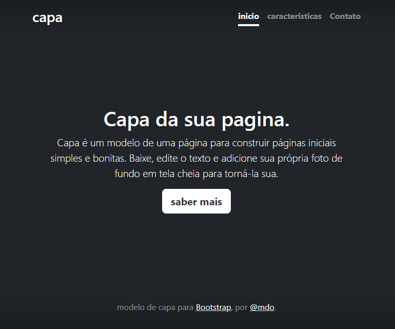

# Índice

[ Projeto - portifolio para escrita do README](#projeto---portifolio-para-escrita-do-readme)  
[Desrição](#descri%C3%A7%C3%A3o)  
[Funcionalidades](#funcionalidades)  
[Tecnologioa utilizadas](#tecnologioa-utilizadas)  
[Fontes consultadas](#fontes-consultadas)  
[Autores](#autores)  

# 🚀Projeto- portífolio para escrita do Readme.

## 📋Descrição 
Projeto usado durante as aulas para fazer um README e tambem utilizando Bootstrap de exemplo de página.

## 🛠️Funcionalidades
Modelo de pagina iniciais basica e bonita  
### ⌨️Tecnologioa utilizadas
Foi utilizado: 
. github  
. VScode  
. HTML  
. CSS  
. Bootstrap  
## 🔩Fontes consultadas
Bootstrap
## ✒️Autores
Amanda vitoria
[Github](https://github.com/amandvitoria)  
Leonardo Rocha  
@mdo
